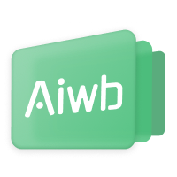

# Awesome-Iwb

适用于希沃、鸿合、京东方、东方中原等品牌的教学一体机、教学触摸屏和红外教学白板的 Windows 平台实用软件推荐合集。**为广大电教倾情撰写。**

**🌟 每一个好的项目都值得被更多的人发现 🌟**

---

## ⚠️ 注意

> [!IMPORTANT]
> **在使用任何软件之前，应仔细阅读其仓库中的 README 或其他形式的说明。**

## 🙏 感谢

**作者：** `ChenCy Lew` 
**主要贡献者：** [Aris-Offline](https://github.com/Aris-Offline)

## 🫧 提醒

1. 若发现任何 错误/过时 信息，请通过添加 `Issue` 使我知晓。当然，您也可以自行创建 `Pull Request` 修改。
2. 欢迎添加内容！请创建 `Pull Request` ，按照当前已有格式添加。
3. 对于软件本体的错误，应在正确途径报告，而不是在本仓库发起 `Issue` 。
4. 不允许直接将二进制分发包包体托管到该仓库内。
5. 有商业版权的软件请先取得企业开发者的同意后再上传，否则您的上传可能会被我们移除或忽略。

## 📚 目录

### ✏️ 批注软件

| 名称 | 开发者 |
| - | - |
| [Ink Canvas](#-ink-canvas)  | `WXRIW` |
| [Ink Canvas Artistry](#-ink-canvas-artistry)  | `ChangSakura` |
| [InkCanvasForClass](#-inkcanvasforclass)  | `Doubx690i` |
| [Ink Canvas Reborn](#-ink-canvas-reborn)  | `ChenCy Lew` |
| [智绘教 Inkeys](#-智绘教-inkeys)  | `Alan-CRL` |
| [Inkways](#-inkways-wip) | `iNKORE Studios` |
| [Inkways Classic](#-inkways-classic) | `iNKORE Studios` |
| [SketchNow](#-sketchnow)  | `realybin` |
| [ppInk](#ppink)  | `pubpub-zz` |

### 📊 课表与桌面小工具

| 名称 | 开发者 |
| - | - |
| [ClassIsland](#-classisland)  | `HelloWRC` |
| [ElectronClassSchedule](#-electronclassschedule)  | `EnderWolf006` |
| [ZongziTEK 黑板贴](#-zongzitek-黑板贴)  | `ZongziTEK` |
| [ClassTools](#classtools)  | `凌莞~(=^▽^=)` |
| [StickyHomeworks](#stickyhomeworks)  | `HelloWRC` |
| [StickyAttention](#-stickyattention)  | `jizilin6732` |
| [HomeworkBoard](#homeworkboard)  | `EnderWolf006` |
| [Class Widgets](#-class-widgets)  | `RinLit-233-shiroko` |
| [Education Clock](#education-clock)  | `Log` |
| [灵动课表](#灵动课表)  | `DuguSand` |
| [ClassBoardSharp](#-classboardsharp)  | `Candlest` |

### 🛠️ 辅助类软件

| 名称 | 开发者 |
| - | - |
| [PPT 触屏辅助](#-ppt-触屏辅助powerpoint-touch-assist)  | `RinLit-233-shiroko` |
| [（希沃）定制启动器](#希沃定制启动器)  | `思锐工作室 SR-Studio` |
| [全能班辅](#全能班辅) | `软硬工作室` |
| [考试看板 Next](#-考试看板-Next)  | `ProjectCampus-CH` |
| [SeewoKiller](#-seewokiller)  | `硬硬屎` |
| [OpenLuckyRandom](#-openluckyrandom)  | `Damon Lu` |
| [MythwareToolkit](#mythwaretoolkit)  | `小流汗黄豆` |
| [ENAL 希沃易登](#enal-希沃易登) | `file.iceawa.com` |

## ✏️ 批注软件

###  Ink Canvas

 

 

[![GitHub Top Language](https://img.shields.io/github/languages/top/WXRIW/Ink-Canvas?logo=data%3Aimage%2Fsvg%2Bxml%3Bbase64%2CPHN2ZyByb2xlPSJpbWciIGZpbGw9IndoaXRlIiB2aWV3Qm94PSIwIDAgMjQgMjQiIHhtbG5zPSJodHRwOi8vd3d3LnczLm9yZy8yMDAwL3N2ZyI%2BPHRpdGxlPkMjPC90aXRsZT48cGF0aCBkPSJNMS4xOTQgNy41NDN2OC45MTNjMCAxLjEwMy41ODggMi4xMjIgMS41NDQgMi42NzRsNy43MTggNC40NTZhMy4wODYgMy4wODYgMCAwIDAgMy4wODggMGw3LjcxOC00LjQ1NmEzLjA4NyAzLjA4NyAwIDAgMCAxLjU0NC0yLjY3NFY3LjU0M2EzLjA4NCAzLjA4NCAwIDAgMC0xLjU0NC0yLjY3M0wxMy41NDQuNDE0YTMuMDg2IDMuMDg2IDAgMCAwLTMuMDg4IDBMMi43MzggNC44N2EzLjA4NSAzLjA4NSAwIDAgMC0xLjU0NCAyLjY3M1ptNS40MDMgMi45MTR2My4wODdhLjc3Ljc3IDAgMCAwIC43NzIuNzcyLjc3My43NzMgMCAwIDAgLjc3Mi0uNzcyLjc3My43NzMgMCAwIDEgMS4zMTctLjU0Ni43NzUuNzc1IDAgMCAxIC4yMjYuNTQ2IDIuMzE0IDIuMzE0IDAgMSAxLTQuNjMxIDB2LTMuMDg3YzAtLjYxNS4yNDQtMS4yMDMuNjc5LTEuNjM3YTIuMzEyIDIuMzEyIDAgMCAxIDMuMjc0IDBjLjQzNC40MzQuNjc4IDEuMDIzLjY3OCAxLjYzN2EuNzY5Ljc2OSAwIDAgMS0uMjI2LjU0NS43NjcuNzY3IDAgMCAxLTEuMDkxIDAgLjc3Ljc3IDAgMCAxLS4yMjYtLjU0NS43Ny43NyAwIDAgMC0uNzcyLS43NzIuNzcxLjc3MSAwIDAgMC0uNzcyLjc3MlptMTIuMzUgMy4wODdhLjc3Ljc3IDAgMCAxLS43NzIuNzcyaC0uNzcydi43NzJhLjc3My43NzMgMCAwIDEtMS41NDQgMHYtLjc3MmgtMS41NDR2Ljc3MmEuNzczLjc3MyAwIDAgMS0xLjMxNy41NDYuNzc1Ljc3NSAwIDAgMS0uMjI2LS41NDZ2LS43NzJIMTJhLjc3MS43NzEgMCAxIDEgMC0xLjU0NGguNzcydi0xLjU0M0gxMmEuNzcuNzcgMCAxIDEgMC0xLjU0NGguNzcydi0uNzcyYS43NzMuNzczIDAgMCAxIDEuMzE3LS41NDYuNzc1Ljc3NSAwIDAgMSAuMjI2LjU0NnYuNzcyaDEuNTQ0di0uNzcyYS43NzMuNzczIDAgMCAxIDEuNTQ0IDB2Ljc3MmguNzcyYS43NzIuNzcyIDAgMCAxIDAgMS41NDRoLS43NzJ2MS41NDNoLjc3MmEuNzc2Ljc3NiAwIDAgMSAuNzcyLjc3MlptLTMuMDg4LTIuMzE1aC0xLjU0NHYxLjU0M2gxLjU0NHYtMS41NDNaIi8%2BPC9zdmc%2B)](https://github.com/WXRIW/Ink-Canvas)

Ink Canvas 画板是一款轻量级画板软件，基于WPF/C#，其针对希沃一体机进行了特别优化，与预装的“希沃白板 5”软件相比，启动速度大幅度提升（提升5-10 倍），系统资源占用更小，使用体验更佳。

学校从传统投影仪换成了希沃白板，由于自带的“希沃白板”软件太难用，也没有同类好用的画板软件，所以开发了该画板。（IC 已死，有事也别烧纸，等重制版吧）

---

🏷 **关键词**：`屏幕批注`, `屏幕画板`, `桌面批注`, `随机抽选`, `白板软件`, `点名器`, `形状识别`

💬 **ChenCy 锐评**：某种意义上来说，如果你想要一个纯粹的屏幕画板，IC 可以是你的选择之一，同时它的诞生，也才有了后面 ICA 和 ICC 的诞生。如果要在教室里面使用不是很合适。

<b> Github 链接</b>: <a href="https://github.com/WXRIW/Ink-Canvas/">WXRIW/Ink-Canvas</a>
 
<b> Github 链接</b>: <a href="https://github.com/InkCanvas/Ink-Canvas/">InkCanvas/Ink-Canvas</a>
 
<b> 开发者</b>: <a href="https://github.com/WXRIW/">WXRIW</a>

###  Ink Canvas Artistry

 

 

[![GitHub Top Language](https://img.shields.io/github/languages/top/InkCanvas/Ink-Canvas-Artistry?logo=data%3Aimage%2Fsvg%2Bxml%3Bbase64%2CPHN2ZyByb2xlPSJpbWciIGZpbGw9IndoaXRlIiB2aWV3Qm94PSIwIDAgMjQgMjQiIHhtbG5zPSJodHRwOi8vd3d3LnczLm9yZy8yMDAwL3N2ZyI%2BPHRpdGxlPkMjPC90aXRsZT48cGF0aCBkPSJNMS4xOTQgNy41NDN2OC45MTNjMCAxLjEwMy41ODggMi4xMjIgMS41NDQgMi42NzRsNy43MTggNC40NTZhMy4wODYgMy4wODYgMCAwIDAgMy4wODggMGw3LjcxOC00LjQ1NmEzLjA4NyAzLjA4NyAwIDAgMCAxLjU0NC0yLjY3NFY3LjU0M2EzLjA4NCAzLjA4NCAwIDAgMC0xLjU0NC0yLjY3M0wxMy41NDQuNDE0YTMuMDg2IDMuMDg2IDAgMCAwLTMuMDg4IDBMMi43MzggNC44N2EzLjA4NSAzLjA4NSAwIDAgMC0xLjU0NCAyLjY3M1ptNS40MDMgMi45MTR2My4wODdhLjc3Ljc3IDAgMCAwIC43NzIuNzcyLjc3My43NzMgMCAwIDAgLjc3Mi0uNzcyLjc3My43NzMgMCAwIDEgMS4zMTctLjU0Ni43NzUuNzc1IDAgMCAxIC4yMjYuNTQ2IDIuMzE0IDIuMzE0IDAgMSAxLTQuNjMxIDB2LTMuMDg3YzAtLjYxNS4yNDQtMS4yMDMuNjc5LTEuNjM3YTIuMzEyIDIuMzEyIDAgMCAxIDMuMjc0IDBjLjQzNC40MzQuNjc4IDEuMDIzLjY3OCAxLjYzN2EuNzY5Ljc2OSAwIDAgMS0uMjI2LjU0NS43NjcuNzY3IDAgMCAxLTEuMDkxIDAgLjc3Ljc3IDAgMCAxLS4yMjYtLjU0NS43Ny43NyAwIDAgMC0uNzcyLS43NzIuNzcxLjc3MSAwIDAgMC0uNzcyLjc3MlptMTIuMzUgMy4wODdhLjc3Ljc3IDAgMCAxLS43NzIuNzcyaC0uNzcydi43NzJhLjc3My43NzMgMCAwIDEtMS41NDQgMHYtLjc3MmgtMS41NDR2Ljc3MmEuNzczLjc3MyAwIDAgMS0xLjMxNy41NDYuNzc1Ljc3NSAwIDAgMS0uMjI2LS41NDZ2LS43NzJIMTJhLjc3MS43NzEgMCAxIDEgMC0xLjU0NGguNzcydi0xLjU0M0gxMmEuNzcuNzcgMCAxIDEgMC0xLjU0NGguNzcydi0uNzcyYS43NzMuNzczIDAgMCAxIDEuMzE3LS41NDYuNzc1Ljc3NSAwIDAgMSAuMjI2LjU0NnYuNzcyaDEuNTQ0di0uNzcyYS43NzMuNzczIDAgMCAxIDEuNTQ0IDB2Ljc3MmguNzcyYS43NzIuNzcyIDAgMCAxIDAgMS41NDRoLS43NzJ2MS41NDNoLjc3MmEuNzc2Ljc3NiAwIDAgMSAuNzcyLjc3MlptLTMuMDg4LTIuMzE1aC0xLjU0NHYxLjU0M2gxLjU0NHYtMS41NDNaIi8%2BPC9zdmc%2B)](https://github.com/InkCanvas/Ink-Canvas-Artistry)

Ink Canvas 的优化版本，添加了更多功能（比如自动收纳、自动查杀、荧光笔、图片插入等功能），并优化了使用体验，使其更适合课堂授课使用。

---

🏷 **关键词**：`屏幕批注`, `屏幕画板`, `桌面批注`, `随机抽选`, `白板软件`, `点名器`, `ICA`, `自动收纳`, `荧光笔`, `PPT批注`, `形状识别`

💬 **ChenCy 锐评**：非常推荐，除掉 ICC，是唯一用着比较舒服的屏幕批注软件，自动收纳有点小问题（2024 年 9 月 21 日，希沃白板 5 和希沃系软件的 Popup 弹窗会出 Bug），图片插入还是测试版，不过依旧还是好用！（来自 ICC 开发者的认可）

<b> Github 链接</b>: <a href="https://github.com/InkCanvas/Ink-Canvas-Artistry/">InkCanvas/Ink-Canvas-Artistry</a>
 
<b> 开发者</b>: <a href="https://github.com/ChangSakura/">ChangSakura</a>

###  InkCanvasForClass

> 该项目已经永久停止更新，原因未知。

 

 

[![GitHub Top Language](https://img.shields.io/github/languages/top/InkCanvas/InkCanvasForClass?logo=data%3Aimage%2Fsvg%2Bxml%3Bbase64%2CPHN2ZyByb2xlPSJpbWciIGZpbGw9IndoaXRlIiB2aWV3Qm94PSIwIDAgMjQgMjQiIHhtbG5zPSJodHRwOi8vd3d3LnczLm9yZy8yMDAwL3N2ZyI%2BPHRpdGxlPkMjPC90aXRsZT48cGF0aCBkPSJNMS4xOTQgNy41NDN2OC45MTNjMCAxLjEwMy41ODggMi4xMjIgMS41NDQgMi42NzRsNy43MTggNC40NTZhMy4wODYgMy4wODYgMCAwIDAgMy4wODggMGw3LjcxOC00LjQ1NmEzLjA4NyAzLjA4NyAwIDAgMCAxLjU0NC0yLjY3NFY3LjU0M2EzLjA4NCAzLjA4NCAwIDAgMC0xLjU0NC0yLjY3M0wxMy41NDQuNDE0YTMuMDg2IDMuMDg2IDAgMCAwLTMuMDg4IDBMMi43MzggNC44N2EzLjA4NSAzLjA4NSAwIDAgMC0xLjU0NCAyLjY3M1ptNS40MDMgMi45MTR2My4wODdhLjc3Ljc3IDAgMCAwIC43NzIuNzcyLjc3My43NzMgMCAwIDAgLjc3Mi0uNzcyLjc3My43NzMgMCAwIDEgMS4zMTctLjU0Ni43NzUuNzc1IDAgMCAxIC4yMjYuNTQ2IDIuMzE0IDIuMzE0IDAgMSAxLTQuNjMxIDB2LTMuMDg3YzAtLjYxNS4yNDQtMS4yMDMuNjc5LTEuNjM3YTIuMzEyIDIuMzEyIDAgMCAxIDMuMjc0IDBjLjQzNC40MzQuNjc4IDEuMDIzLjY3OCAxLjYzN2EuNzY5Ljc2OSAwIDAgMS0uMjI2LjU0NS43NjcuNzY3IDAgMCAxLTEuMDkxIDAgLjc3Ljc3IDAgMCAxLS4yMjYtLjU0NS43Ny43NyAwIDAgMC0uNzcyLS43NzIuNzcxLjc3MSAwIDAgMC0uNzcyLjc3MlptMTIuMzUgMy4wODdhLjc3Ljc3IDAgMCAxLS43NzIuNzcyaC0uNzcydi43NzJhLjc3My43NzMgMCAwIDEtMS41NDQgMHYtLjc3MmgtMS41NDR2Ljc3MmEuNzczLjc3MyAwIDAgMS0xLjMxNy41NDYuNzc1Ljc3NSAwIDAgMS0uMjI2LS41NDZ2LS43NzJIMTJhLjc3MS43NzEgMCAxIDEgMC0xLjU0NGguNzcydi0xLjU0M0gxMmEuNzcuNzcgMCAxIDEgMC0xLjU0NGguNzcydi0uNzcyYS43NzMuNzczIDAgMCAxIDEuMzE3LS41NDYuNzc1Ljc3NSAwIDAgMSAuMjI2LjU0NnYuNzcyaDEuNTQ0di0uNzcyYS43NzMuNzczIDAgMCAxIDEuNTQ0IDB2Ljc3MmguNzcyYS43NzIuNzcyIDAgMCAxIDAgMS41NDRoLS43NzJ2MS41NDNoLjc3MmEuNzc2Ljc3NiAwIDAgMSAuNzcyLjc3MlptLTMuMDg4LTIuMzE1aC0xLjU0NHYxLjU0M2gxLjU0NHYtMS41NDNaIi8%2BPC9zdmc%2B)](https://github.com/InkCanvas/InkCanvasForClass)

Ink Canvas Artistry 的优化版本，重写了底层代码，优化了整体 UI 和程序性能，并带来了许多新功能（如鼠标手势，画面冻结，重制版形状绘制系统）。

InkCanvasForClass 是基于 ChangSakura 的 Ink Canvas Artistry 项目二次开发而来。该项目着重于优化原项目的 UI 设计，使其更便于课堂使用，同时也在积极开发新功能，修理原项目的不合理之处。

---

🏷 **关键词**：`屏幕批注`, `屏幕画板`, `桌面批注`, `随机抽选`, `白板软件`, `点名器`, `ICA`, `ICC`, `边缘手势禁用`, `高性能`, `PPT批注`, `形状识别`

💬 **ChenCy 锐评**：新起点，新启航，ICC 挑过了 IC 和 ICA 肩上的重担，负重前行。目前正在重构底层代码中...，逗比欢迎大家尝鲜使用 **（不过逗比不建议在课堂上或者正式教学环境下使用）**

💬 **Aris 锐评**：随着 IC 和 ICA 的相继停更，ICC 或许扛起了 IC 系列的大旗？Dubi 现在正在积极制作，UI 和功能也值得期待，作为友商 staff 期待蓬勃发展ヾ(≧▽≦*)o

<b> Github 链接</b>: <a href="https://github.com/InkCanvas/InkCanvasForClass/">InkCanvas/InkCanvasForClass</a> (已归档)
 
<b> 开发者</b>: <a href="https://github.com/kriastans/">Doubx690i</a> (账号已注销)

###  Ink Canvas Reborn

 

 

Ink Canvas Reborn 是 Ink Canvas 画板的重生版，是基于 Ink Canvas 的设计理念和 UI 设计完全重构的一个项目，不基于任何先前项目的代码。相较于原版，ICR 提供了更加流畅高性能的体验、更易用的工具栏优化、以及部分新功能的合入。

💬 **ChenCy 锐评**：继 ICC 之后，又出了一个 Ink Canvas 家族的重制版，不知道这次，他能否经受住时间的考验呢？反正我对此是很看好的。

<b> Github 链接</b>: <a href="https://github.com/dubi906w/Ink-Canvas-Reborn/">dubi906w/Ink-Canvas-Reborn</a>
 
<b> Github 链接</b>: <a href="https://github.com/InkCanvas/Ink-Canvas-Reborn/">InkCanvas/Ink-Canvas-Reborn</a>
 
<b> 开发者</b>: <a href="https://github.com/dubi906w/">ChenCy Lew</a>

###  智绘教 Inkeys

> 原名: `Intelligent-Drawing-Teaching`（IDT），中文: 智绘教

 

 

Windows 屏幕批注工具，拥有高效批注和丰富功能，让屏幕演示变得简单，让教学授课变得高效，适用于触摸设备和 PC 端。

---

🏷 **关键词**：`屏幕批注`, `屏幕画板`, `桌面批注`, `手抖修正`, `多指书写`

💬 **ChenCy 锐评**：用下来总体体验是不错的，自带了屏幕冻结这个好功能，还有桌面画板悬浮窗拦截，以及各种强制置顶，多虚拟桌面Pin，多显示器适配等，这些功能都很不错，甚至有些都是被 ICC 给借鉴过去了的功能，比较推荐使用。最近出了内测版本，用 **Fluent Design System** 重构了设置页面，非常好看（有需要可以加入他们的 QQ 群了解更多，2024年12月4日更新）

<b> Github 链接</b>: <a href="https://github.com/Alan-CRL/Inkeys/">Alan-CRL/Inkeys</a>
 
<b> bilibili 宣传影片</b>: <a href="https://www.bilibili.com/video/BV1Tz421z72e/">https://www.bilibili.com/video/BV1Tz421z72e/</a>
 
<b> 开发者</b>: <a href="https://github.com/Alan-CRL/">Alan-CRL</a>

###  Inkways (WIP)

 

> [!note]
>
> 本软件仍在~~画饼~~开发阶段，如有需要请先使用 Inkways Classic，或加入社区以获取最新消息。

跨平台且易用的，集笔记，办公，教育等场景于一体的完整墨迹套件。(Coming soon)

💬 **ChenCy 锐评**：期待我有生之年能看到 iNKORE Corp 开在新加坡，去当码农。

<b>官网链接</b>: <a href="https://inkore.net/products/inkways/">https://inkore.net/products/inkways/</a>（维护中）
 
<b> 开发者</b>: <a href="https://github.com/iNKORE-NET/">iNKORE Studios</a>

###  Inkways Classic

 

完全契合 Windows 11 风格的，轻量但全能并适用于教学场景的墨迹套件。支持插入文本图片，模拟和原生压感，撤消重做，多页文档... 本套件包含笔记，画板，桌面画笔和 PowerPoint 助手。

---

🏷 **关键词**：`Fluent Design System` `多插件` `多功能套件` `笔记`

💬 **ChenCy 锐评**：总体不如 Ink Canvas 系列，可以尝试一下，UI 设计比较好看，但是有部分功能还未完善，希望有生之年能看见 Inkways Vanilla 出来。

💬 **Aris 锐评**：u1s1 尝鲜可以，但是不建议在学校长期使用，还不如等 Inkways Vanilla。

<b>官网链接</b>: <a href="https://inkore.net/products/inkways/">https://inkore.net/products/inkways/</a>（维护中）
 
<b> 开发者</b>: <a href="https://github.com/iNKORE-NET/">iNKORE Studios</a>

###  SketchNow

 

 

SketchNow 是一款现代 Windows 绘图工具，可让您在屏幕上的任何位置实时绘制草图。它采用 Material Design 设计，界面优雅，支持压感输入。该应用程序注重隐私，将所有数据保存在本地，仅在版本更新时连接到 GitHub。SketchNow 带来了在屏幕任意位置绘图的自由，同时保持了系统的稳定性和性能。

SketchNow 基本上算是 Ink Canvas 的后继者了，虽然明面上和 Ink Canvas 家族没有关系，但实际上底层还是使用的是 WPF 的 InkCanvas 控件。只不过比 IC 家族好太多了（人家用的是 MVVM！）。

**目前虽然还没有中文支持，不过开发者是大学生，因此空闲时间也比较多，开发的效率也比较高，最近也比较活跃。据悉，SketchNow 后续版本将提供几何绘图，模拟笔锋等高级功能。**

> 你们大学生👨‍🎓也是被使唤上了好吧🤓☝️

💬 **ChenCy 锐评**：又一个新开的基于 InkCanvas 控件的项目，希望后面能够继续发展吧，争取能够干爆 Ink Canvas，虽然目前功能还不是很多，还没有中文支持，不过前途是一片光明啊。

<b> Github 链接</b>: <a href="https://github.com/SketchNow/SketchNow.WPF/">SketchNow/SketchNow.WPF</a>
 
<b> 开发者</b>: <a href="https://github.com/realybin/">realybin</a>

### ppInk

> Forked from [geovens/gInk](https://github.com/geovens/gInk)

 

 

ppInk is a user-friendly on-screen annotation software for Windows, compatible with Mouse use, touchscreen or drawing tablet(also with pressure).

源自 gInk 它提供了许多新功能，这些功能自由地从其他应用程序（如 Epic Pen）中汲取灵感，使其更易于使用，功能更强大。ppInk/gInk 的设计秉承了简洁的理念，确保在演示过程中不会分散演示者或观众的注意力。ppInk 允许您选择不同的笔进行绘图，每支笔都有可配置的属性，而不必调整颜色、透明度和笔尖宽度、笔触等单个设置。

<b> Github 链接</b>: <a href="https://github.com/pubpub-zz/ppInk/">pubpub-zz/ppInk</a>
 
<b> 开发者</b>: <a href="https://github.com/pubpub-zz/">pubpub-zz</a>

## 📊 课表与桌面小工具

###  ClassIsland

 

 

[![GitHub Top Language](https://img.shields.io/github/languages/top/ClassIsland/ClassIsland?logo=data%3Aimage%2Fsvg%2Bxml%3Bbase64%2CPHN2ZyByb2xlPSJpbWciIGZpbGw9IndoaXRlIiB2aWV3Qm94PSIwIDAgMjQgMjQiIHhtbG5zPSJodHRwOi8vd3d3LnczLm9yZy8yMDAwL3N2ZyI%2BPHRpdGxlPkMjPC90aXRsZT48cGF0aCBkPSJNMS4xOTQgNy41NDN2OC45MTNjMCAxLjEwMy41ODggMi4xMjIgMS41NDQgMi42NzRsNy43MTggNC40NTZhMy4wODYgMy4wODYgMCAwIDAgMy4wODggMGw3LjcxOC00LjQ1NmEzLjA4NyAzLjA4NyAwIDAgMCAxLjU0NC0yLjY3NFY3LjU0M2EzLjA4NCAzLjA4NCAwIDAgMC0xLjU0NC0yLjY3M0wxMy41NDQuNDE0YTMuMDg2IDMuMDg2IDAgMCAwLTMuMDg4IDBMMi43MzggNC44N2EzLjA4NSAzLjA4NSAwIDAgMC0xLjU0NCAyLjY3M1ptNS40MDMgMi45MTR2My4wODdhLjc3Ljc3IDAgMCAwIC43NzIuNzcyLjc3My43NzMgMCAwIDAgLjc3Mi0uNzcyLjc3My43NzMgMCAwIDEgMS4zMTctLjU0Ni43NzUuNzc1IDAgMCAxIC4yMjYuNTQ2IDIuMzE0IDIuMzE0IDAgMSAxLTQuNjMxIDB2LTMuMDg3YzAtLjYxNS4yNDQtMS4yMDMuNjc5LTEuNjM3YTIuMzEyIDIuMzEyIDAgMCAxIDMuMjc0IDBjLjQzNC40MzQuNjc4IDEuMDIzLjY3OCAxLjYzN2EuNzY5Ljc2OSAwIDAgMS0uMjI2LjU0NS43NjcuNzY3IDAgMCAxLTEuMDkxIDAgLjc3Ljc3IDAgMCAxLS4yMjYtLjU0NS43Ny43NyAwIDAgMC0uNzcyLS43NzIuNzcxLjc3MSAwIDAgMC0uNzcyLjc3MlptMTIuMzUgMy4wODdhLjc3Ljc3IDAgMCAxLS43NzIuNzcyaC0uNzcydi43NzJhLjc3My43NzMgMCAwIDEtMS41NDQgMHYtLjc3MmgtMS41NDR2Ljc3MmEuNzczLjc3MyAwIDAgMS0xLjMxNy41NDYuNzc1Ljc3NSAwIDAgMS0uMjI2LS41NDZ2LS43NzJIMTJhLjc3MS43NzEgMCAxIDEgMC0xLjU0NGguNzcydi0xLjU0M0gxMmEuNzcuNzcgMCAxIDEgMC0xLjU0NGguNzcydi0uNzcyYS43NzMuNzczIDAgMCAxIDEuMzE3LS41NDYuNzc1Ljc3NSAwIDAgMSAuMjI2LjU0NnYuNzcyaDEuNTQ0di0uNzcyYS43NzMuNzczIDAgMCAxIDEuNTQ0IDB2Ljc3MmguNzcyYS43NzIuNzcyIDAgMCAxIDAgMS41NDRoLS43NzJ2MS41NDNoLjc3MmEuNzc2Ljc3NiAwIDAgMSAuNzcyLjc3MlptLTMuMDg4LTIuMzE1aC0xLjU0NHYxLjU0M2gxLjU0NHYtMS41NDNaIi8%2BPC9zdmc%2B)](https://github.com/ClassIsland/ClassIsland)

ClassIsland 是一款适用于班级多媒体屏幕的课表信息显示工具，可以在 Windows 屏幕上显示各种信息。本应用的名字灵感源于 iOS 灵动岛（Dynamic Island）功能。可显示当天的课表、当前进行课程的信息，在上下课等重要时间点发出提醒，自选搭配音效、强调特效和语音增强提醒。

💬 **ChenCy 锐评**：非常好用，开学必装，支持多周轮换和临时课表，以及超高的自定义程度，CI 已经是目前最强大的桌面课表软件了，最近还上线了插件系统，可以通过自己开发插件来扩充 CI 的功能，非常推荐！

<b> Github 链接</b>: <a href="https://github.com/ClassIsland/ClassIsland/">ClassIsland/ClassIsland</a>
 
<b> .NET 6 兼容版仓库</b>: <a href="https://github.com/ClassIsland/ClassIsland-net6/">ClassIsland/ClassIsland-net6</a>
 
<b> bilibili 宣传影片</b>: <a href="https://www.bilibili.com/video/BV1Lt421n7op/">https://www.bilibili.com/video/BV1Lt421n7op/</a>
 
<b> 开发者</b>: <a href="https://github.com/ClassIsland/">ClassIsland</a>
 
<b> 主要开发者</b>: <a href="https://github.com/HelloWRC/">HelloWRC</a>

###  ElectronClassSchedule

 

 

ElectronClassSchedule 具有显示当天课表，当前星期，天数倒计时，下课/上课倒计时等功能。支持动态调整课表，支持多周(最多四周)课表轮换，窗口置顶且可穿透。 
**软件由一位高三牲制作，含有大量屎山代码，望大家海涵。**

<b> Github 链接</b>: <a href="https://github.com/EnderWolf006/ElectronClassSchedule/">EnderWolf006/ElectronClassSchedule</a>
 
<b> bilibili 宣传影片</b>: <a href="https://www.bilibili.com/video/BV1Wm411k7n8/">https://www.bilibili.com/video/BV1Wm411k7n8/</a>
 
<b> 开发者</b>: <a href="https://github.com/EnderWolf006/">EnderWolf006</a>

###  ZongziTEK 黑板贴

 

 

[![GitHub Top Language](https://img.shields.io/github/languages/top/STBBRD/ZongziTEK-Blackboard-Sticker?logo=data%3Aimage%2Fsvg%2Bxml%3Bbase64%2CPHN2ZyByb2xlPSJpbWciIGZpbGw9IndoaXRlIiB2aWV3Qm94PSIwIDAgMjQgMjQiIHhtbG5zPSJodHRwOi8vd3d3LnczLm9yZy8yMDAwL3N2ZyI%2BPHRpdGxlPkMjPC90aXRsZT48cGF0aCBkPSJNMS4xOTQgNy41NDN2OC45MTNjMCAxLjEwMy41ODggMi4xMjIgMS41NDQgMi42NzRsNy43MTggNC40NTZhMy4wODYgMy4wODYgMCAwIDAgMy4wODggMGw3LjcxOC00LjQ1NmEzLjA4NyAzLjA4NyAwIDAgMCAxLjU0NC0yLjY3NFY3LjU0M2EzLjA4NCAzLjA4NCAwIDAgMC0xLjU0NC0yLjY3M0wxMy41NDQuNDE0YTMuMDg2IDMuMDg2IDAgMCAwLTMuMDg4IDBMMi43MzggNC44N2EzLjA4NSAzLjA4NSAwIDAgMC0xLjU0NCAyLjY3M1ptNS40MDMgMi45MTR2My4wODdhLjc3Ljc3IDAgMCAwIC43NzIuNzcyLjc3My43NzMgMCAwIDAgLjc3Mi0uNzcyLjc3My43NzMgMCAwIDEgMS4zMTctLjU0Ni43NzUuNzc1IDAgMCAxIC4yMjYuNTQ2IDIuMzE0IDIuMzE0IDAgMSAxLTQuNjMxIDB2LTMuMDg3YzAtLjYxNS4yNDQtMS4yMDMuNjc5LTEuNjM3YTIuMzEyIDIuMzEyIDAgMCAxIDMuMjc0IDBjLjQzNC40MzQuNjc4IDEuMDIzLjY3OCAxLjYzN2EuNzY5Ljc2OSAwIDAgMS0uMjI2LjU0NS43NjcuNzY3IDAgMCAxLTEuMDkxIDAgLjc3Ljc3IDAgMCAxLS4yMjYtLjU0NS43Ny43NyAwIDAgMC0uNzcyLS43NzIuNzcxLjc3MSAwIDAgMC0uNzcyLjc3MlptMTIuMzUgMy4wODdhLjc3Ljc3IDAgMCAxLS43NzIuNzcyaC0uNzcydi43NzJhLjc3My43NzMgMCAwIDEtMS41NDQgMHYtLjc3MmgtMS41NDR2Ljc3MmEuNzczLjc3MyAwIDAgMS0xLjMxNy41NDYuNzc1Ljc3NSAwIDAgMS0uMjI2LS41NDZ2LS43NzJIMTJhLjc3MS43NzEgMCAxIDEgMC0xLjU0NGguNzcydi0xLjU0M0gxMmEuNzcuNzcgMCAxIDEgMC0xLjU0NGguNzcydi0uNzcyYS43NzMuNzczIDAgMCAxIDEuMzE3LS41NDYuNzc1Ljc3NSAwIDAgMSAuMjI2LjU0NnYuNzcyaDEuNTQ0di0uNzcyYS43NzMuNzczIDAgMCAxIDEuNTQ0IDB2Ljc3MmguNzcyYS43NzIuNzcyIDAgMCAxIDAgMS41NDRoLS43NzJ2MS41NDNoLjc3MmEuNzc2Ljc3NiAwIDAgMSAuNzcyLjc3MlptLTMuMDg4LTIuMzE1aC0xLjU0NHYxLjU0M2gxLjU0NHYtMS41NDNaIi8%2BPC9zdmc%2B)](https://github.com/STBBRD/ZongziTEK-Blackboard-Sticker)

用于白板一体机的桌面小部件，享受抬手即用的小黑板、高效的信息展示、便捷的课程管理和多项实用功能，满足班级的各种需求。

💬 **ChenCy 锐评**：还行，如果有小黑板需求可以使用，自带的课程表功能个人感觉有点鸡肋，不过也还算好用的，官网也是完全学到了微软式中文。比较推荐（如果不用 CI 的话）

<b> Github 链接</b>: <a href="https://github.com/STBBRD/ZongziTEK-Blackboard-Sticker/">STBBRD/ZongziTEK-Blackboard-Sticker</a>
 
<b> 开发者</b>: <a href="https://github.com/STBBRD/">ZongziTEK</a>

### ClassTools

> 该项目已经停止更新。

 

 

这是一个用在班级电脑上面的教室系统🎉，以动态壁纸方式呈现高考倒计时、作业、课程表、值日生等看板，并提供简单易用的设置界面。

<b> Github 链接</b>: <a href="https://github.com/clansty/ClassTools/">clansty/ClassTools</a>
 
<b> 开发者</b>: <a href="https://github.com/clansty/">凌莞~(=^▽^=)</a>

### StickyHomeworks

> 该项目已经停止更新，因为开发者弃坑了。

 

 

[![GitHub Top Language](https://img.shields.io/github/languages/top/HelloWRC/StickyHomeworks?logo=data%3Aimage%2Fsvg%2Bxml%3Bbase64%2CPHN2ZyByb2xlPSJpbWciIGZpbGw9IndoaXRlIiB2aWV3Qm94PSIwIDAgMjQgMjQiIHhtbG5zPSJodHRwOi8vd3d3LnczLm9yZy8yMDAwL3N2ZyI%2BPHRpdGxlPkMjPC90aXRsZT48cGF0aCBkPSJNMS4xOTQgNy41NDN2OC45MTNjMCAxLjEwMy41ODggMi4xMjIgMS41NDQgMi42NzRsNy43MTggNC40NTZhMy4wODYgMy4wODYgMCAwIDAgMy4wODggMGw3LjcxOC00LjQ1NmEzLjA4NyAzLjA4NyAwIDAgMCAxLjU0NC0yLjY3NFY3LjU0M2EzLjA4NCAzLjA4NCAwIDAgMC0xLjU0NC0yLjY3M0wxMy41NDQuNDE0YTMuMDg2IDMuMDg2IDAgMCAwLTMuMDg4IDBMMi43MzggNC44N2EzLjA4NSAzLjA4NSAwIDAgMC0xLjU0NCAyLjY3M1ptNS40MDMgMi45MTR2My4wODdhLjc3Ljc3IDAgMCAwIC43NzIuNzcyLjc3My43NzMgMCAwIDAgLjc3Mi0uNzcyLjc3My43NzMgMCAwIDEgMS4zMTctLjU0Ni43NzUuNzc1IDAgMCAxIC4yMjYuNTQ2IDIuMzE0IDIuMzE0IDAgMSAxLTQuNjMxIDB2LTMuMDg3YzAtLjYxNS4yNDQtMS4yMDMuNjc5LTEuNjM3YTIuMzEyIDIuMzEyIDAgMCAxIDMuMjc0IDBjLjQzNC40MzQuNjc4IDEuMDIzLjY3OCAxLjYzN2EuNzY5Ljc2OSAwIDAgMS0uMjI2LjU0NS43NjcuNzY3IDAgMCAxLTEuMDkxIDAgLjc3Ljc3IDAgMCAxLS4yMjYtLjU0NS43Ny43NyAwIDAgMC0uNzcyLS43NzIuNzcxLjc3MSAwIDAgMC0uNzcyLjc3MlptMTIuMzUgMy4wODdhLjc3Ljc3IDAgMCAxLS43NzIuNzcyaC0uNzcydi43NzJhLjc3My43NzMgMCAwIDEtMS41NDQgMHYtLjc3MmgtMS41NDR2Ljc3MmEuNzczLjc3MyAwIDAgMS0xLjMxNy41NDYuNzc1Ljc3NSAwIDAgMS0uMjI2LS41NDZ2LS43NzJIMTJhLjc3MS43NzEgMCAxIDEgMC0xLjU0NGguNzcydi0xLjU0M0gxMmEuNzcuNzcgMCAxIDEgMC0xLjU0NGguNzcydi0uNzcyYS43NzMuNzczIDAgMCAxIDEuMzE3LS41NDYuNzc1Ljc3NSAwIDAgMSAuMjI2LjU0NnYuNzcyaDEuNTQ0di0uNzcyYS43NzMuNzczIDAgMCAxIDEuNTQ0IDB2Ljc3MmguNzcyYS43NzIuNzcyIDAgMCAxIDAgMS41NDRoLS43NzJ2MS41NDNoLjc3MmEuNzc2Ljc3NiAwIDAgMSAuNzcyLjc3MlptLTMuMDg4LTIuMzE1aC0xLjU0NHYxLjU0M2gxLjU0NHYtMS41NDNaIi8%2BPC9zdmc%2B)](https://github.com/HelloWRC/StickyHomeworks)

StickyHomeworks 是一款支持富文本的桌面作业贴工具。支持按科目分组作业、为作业添加标签、自动清理过期作业、导出作业截图等功能。

<b> Github 链接</b>: <a href="https://github.com/HelloWRC/StickyHomeworks/">HelloWRC/StickyHomeworks</a>
 
<b> 开发者</b>: <a href="https://github.com/HelloWRC/">HelloWRC</a>

###  StickyAttention

 

 

[![GitHub Top Language](https://img.shields.io/github/languages/top/Sticky-attention/Sticky-attention?logo=data%3Aimage%2Fsvg%2Bxml%3Bbase64%2CPHN2ZyByb2xlPSJpbWciIGZpbGw9IndoaXRlIiB2aWV3Qm94PSIwIDAgMjQgMjQiIHhtbG5zPSJodHRwOi8vd3d3LnczLm9yZy8yMDAwL3N2ZyI%2BPHRpdGxlPkMjPC90aXRsZT48cGF0aCBkPSJNMS4xOTQgNy41NDN2OC45MTNjMCAxLjEwMy41ODggMi4xMjIgMS41NDQgMi42NzRsNy43MTggNC40NTZhMy4wODYgMy4wODYgMCAwIDAgMy4wODggMGw3LjcxOC00LjQ1NmEzLjA4NyAzLjA4NyAwIDAgMCAxLjU0NC0yLjY3NFY3LjU0M2EzLjA4NCAzLjA4NCAwIDAgMC0xLjU0NC0yLjY3M0wxMy41NDQuNDE0YTMuMDg2IDMuMDg2IDAgMCAwLTMuMDg4IDBMMi43MzggNC44N2EzLjA4NSAzLjA4NSAwIDAgMC0xLjU0NCAyLjY3M1ptNS40MDMgMi45MTR2My4wODdhLjc3Ljc3IDAgMCAwIC43NzIuNzcyLjc3My43NzMgMCAwIDAgLjc3Mi0uNzcyLjc3My43NzMgMCAwIDEgMS4zMTctLjU0Ni43NzUuNzc1IDAgMCAxIC4yMjYuNTQ2IDIuMzE0IDIuMzE0IDAgMSAxLTQuNjMxIDB2LTMuMDg3YzAtLjYxNS4yNDQtMS4yMDMuNjc5LTEuNjM3YTIuMzEyIDIuMzEyIDAgMCAxIDMuMjc0IDBjLjQzNC40MzQuNjc4IDEuMDIzLjY3OCAxLjYzN2EuNzY5Ljc2OSAwIDAgMS0uMjI2LjU0NS43NjcuNzY3IDAgMCAxLTEuMDkxIDAgLjc3Ljc3IDAgMCAxLS4yMjYtLjU0NS43Ny43NyAwIDAgMC0uNzcyLS43NzIuNzcxLjc3MSAwIDAgMC0uNzcyLjc3MlptMTIuMzUgMy4wODdhLjc3Ljc3IDAgMCAxLS43NzIuNzcyaC0uNzcydi43NzJhLjc3My43NzMgMCAwIDEtMS41NDQgMHYtLjc3MmgtMS41NDR2Ljc3MmEuNzczLjc3MyAwIDAgMS0xLjMxNy41NDYuNzc1Ljc3NSAwIDAgMS0uMjI2LS41NDZ2LS43NzJIMTJhLjc3MS43NzEgMCAxIDEgMC0xLjU0NGguNzcydi0xLjU0M0gxMmEuNzcuNzcgMCAxIDEgMC0xLjU0NGguNzcydi0uNzcyYS43NzMuNzczIDAgMCAxIDEuMzE3LS41NDYuNzc1Ljc3NSAwIDAgMSAuMjI2LjU0NnYuNzcyaDEuNTQ0di0uNzcyYS43NzMuNzczIDAgMCAxIDEuNTQ0IDB2Ljc3MmguNzcyYS43NzIuNzcyIDAgMCAxIDAgMS41NDRoLS43NzJ2MS41NDNoLjc3MmEuNzc2Ljc3NiAwIDAgMSAuNzcyLjc3MlptLTMuMDg4LTIuMzE1aC0xLjU0NHYxLjU0M2gxLjU0NHYtMS41NDNaIi8%2BPC9zdmc%2B)](https://github.com/Sticky-attention/Sticky-attention)

StickyAttention 是一款适用于 Windows 系统教室一体机的作业显示工具，基于 [HelloWRC/StickyHomeworks](https://github.com/HelloWRC/StickyHomeworks/) 开发，可以展示各科作业信息，且支持富文本，按科目分类，导出作业截图等功能。后续将添加更多新内容，敬请期待！

<b> Github 链接</b>: <a href="https://github.com/Sticky-attention/Sticky-attention/">Sticky-attention/Sticky-attention</a>
 
<b> 开发者</b>: <a href="https://github.com/jizilin6732/">jizilin6732</a>

### HomeworkBoard

 

 

作业板，可以在班级内记录并排版清晰地展示作业、快捷记录出勤情况(无此需求可以去掉这一板块)，可以使用微软手写输入法或拼音(如有实体键盘)快速录入作业

<b> Github 链接</b>: <a href="https://github.com/EnderWolf006/HomeworkBoard/">EnderWolf006/HomeworkBoard</a>
 
<b> 开发者</b>: <a href="https://github.com/EnderWolf006/">EnderWolf006</a>

###  Class Widgets

 

 

Class Widgets 是一款能够显示当前课程的桌面组件应用程序。其提供了易用课程表编辑和美观的桌面组件。

💬 **ChenCy 锐评**：看到 UI 上有能和 CI 抗衡的也是比较欣慰了，不过目前来说还需要更多优化，比如没有天气功能，以及部分功能还不是太完善等，不过开发与更新速度也挺快，比较期待，但是目前来说不会正式在教学环境使用。

<b> Github 链接</b>: <a href="https://github.com/RinLit-233-shiroko/Class-Widgets/">RinLit-233-shiroko/Class-Widgets</a>
 
<b> bilibili 宣传影片</b>: <a href="https://www.bilibili.com/video/BV1xwW9eyEGu/">https://www.bilibili.com/video/BV1xwW9eyEGu/</a>
 
<b> 开发者</b>: <a href="https://github.com/RinLit-233-shiroko/">RinLit-233-shiroko</a>

### Education Clock

 

 

桌面时钟、课程表、天气预报、自动新闻联播、定时关机、邮件公告板

<b> Github 链接</b>: <a href="https://github.com/Return-Log/Education-Clock/">Return-Log/Education-Clock</a>
 
<b> 开发者</b>: <a href="https://github.com/Return-Log/">Log</a>

### 灵动课表

 

 

一个桌面课表软件。根据当日星期几显示配置文件中对应的课表，支持分隔符来规划课表内容。

<b> Github 链接</b>: <a href="https://github.com/DuguSand/class_form/">DuguSand/class_form</a>
 
<b> 开发者</b>: <a href="https://github.com/DuguSand/">DuguSand</a>

###  ClassBoardSharp

 

 

 

ClassBoard 是一款高自由度的，用于显示教学信息的壁纸软件，功能包括高考倒计时、公告栏、以及能够提示当前课程的课程表。ClassBoard 以兼容性为核心（支持希沃老设备），兼顾自由性和可用性（自定义程度高，但是能够做到开箱即用），力求成为一款易用且好用的一体机壁纸软件。

💬 **ChenCy 锐评**：很小众的项目，和 `clansty/ClassTools` 有点类似。

<b> Github 链接</b>: <a href="https://github.com/Candlest/ClassBoardSharp/">Candlest/ClassBoardSharp</a>
 
<b> 开发者</b>: <a href="https://github.com/Candlest/">Candlest</a>

## 🛠️ 辅助类软件

###  PPT 触屏辅助(PowerPoint Touch Assist)

 

 

PPT 触屏辅助 此程序让你能在 Windows 10/11 中更高效地以“单击”翻页。

<b> Github 链接</b>: <a href="https://github.com/RinLit-233-shiroko/PowerPoint-Touch-Assist/">RinLit-233-shiroko/PowerPoint-Touch-Assist</a>
 
<b> bilibili 宣传影片</b>: <a href="https://www.bilibili.com/video/BV1G6Y7eLEA1/">https://www.bilibili.com/video/BV1G6Y7eLEA1/</a>
 
<b> 开发者</b>: <a href="https://github.com/RinLit-233-shiroko/">RinLit-233-shiroko</a>

### （希沃）定制启动器

 

 

定制启动器，旨在让大多数软件的启动方式更加绚丽多彩。为 希沃白板 系列量身定做，其他程序也可以使用！🥳

💬 **ChenCy 锐评**：如标题所述，如果只是想让希沃白板的 Splash Screen 变得高端大气上档次一些的话，我觉得还是不错的，部分小问题无伤大雅。

<b> Github 链接</b>: <a href="https://github.com/SRInternet-Studio/Seewo-Custom_Start/">SRInternet-Studio/Seewo-Custom_Start</a>
 
<b> bilibili 宣传影片</b>: <a href="https://www.bilibili.com/video/BV1ky42187JM/">https://www.bilibili.com/video/BV1ky42187JM/</a>
 
<b> 开发者</b>: <a href="https://github.com/SRInternet-Studio/">思锐工作室 SR-Studio</a>

### 全能班辅

 

 

显示今天的值日生，小工具，随机点名功能，展示自定义课表。

<b> Github 链接</b>: <a href="https://github.com/XeonMEMZ/qnbf5/">XeonMEMZ/qnbf5</a>
 
<b> Github 链接</b>: <a href="https://github.com/XeonMEMZ/qnbf4/">XeonMEMZ/qnbf4</a>
 
<b> bilibili 宣传影片</b>: <a href="https://www.bilibili.com/video/BV1zeWneCEmh/">https://www.bilibili.com/video/BV1zeWneCEmh/</a>
 
<b> 开发者</b>: <a href="https://space.bilibili.com/404100570/">软硬工作室</a>

###  考试看板 Next

 

 

DSZ考试看板的复活版。**一款显示当前时间与考试详细信息的看板类软件。**

**考试看板** 皆在提供一个简单明了的 UI 界面用于展示考试信息：可以展示考试名称、当前时间、当前科目名称、开始时间、结束时间、考试状态、考试结束前 15 分钟预警，右面可以展示所有考试列表及开始时间、结束时间和状态，后面会支持集控。

<b> Github 链接</b>: <a href="https://github.com/ProjectCampus-CH/dsz-exam-showboard-next/">ProjectCampus-CH/dsz-exam-showboard-next</a>
 
<b> 开发者</b>: <a href="https://github.com/ProjectCampus-CH/">ProjectCampus-CH</a>

###  SeewoKiller

 

 

希沃克星是一个专干希沃的工具。冰点还原、制裁晚自习、强制关闭希沃管家...

<b> Github 链接</b>: <a href="https://github.com/whstu/SeewoKiller/">whstu/SeewoKiller</a>
 
<b> 开发者</b>: <a href="https://github.com/whstu/">硬硬屎</a>